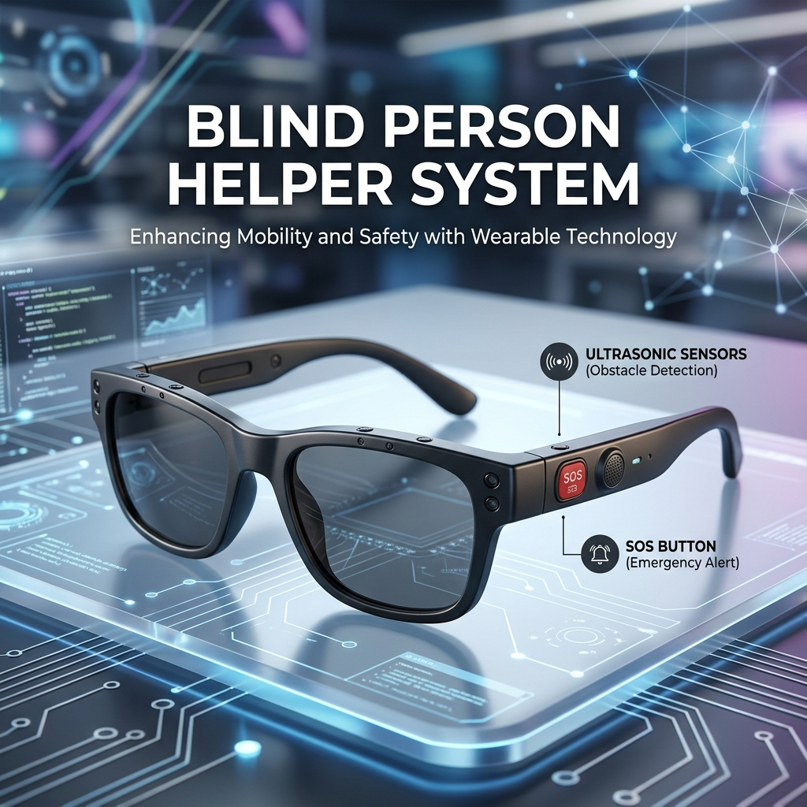

<div align="center">
  
  
  # 📘 Blind Person Helper System (ESP32 Based)
  
  **An IoT-enabled assistive technology device for visually impaired individuals, featuring real-time obstacle detection and emergency SOS alerts.**
  
  [](#)
  [](#)
  [](#)
  [](#)
</div>

---

## 🧠 1. Introduction

The **Blind Person Helper System** is a low-cost, wearable assistive technology project (often implemented as smart glasses or a smart walking stick) designed to help visually impaired individuals navigate their surroundings safely. 

This system leverages **ultrasonic sensors** to detect obstacles in three primary directions (front, left, right) and provides intuitive, directional haptic feedback using **vibration motors**. 

Furthermore, to ensure user safety in critical situations, an **SOS emergency feature** is integrated using a touch sensor and the **Twilio API**. In case of an emergency, the user can press the touch sensor to instantly send an SMS alert to a predefined emergency contact via WiFi.

---

## 🎯 2. Project Objectives

- 🛑 **Real-Time Obstacle Detection:** Identify objects within a critical range (e.g., 5 cm).
- 📳 **Directional Haptic Feedback:** Provide specific vibration alerts based on the obstacle's location.
- 📡 **Emergency Communication:** Allow the user to send a fast SOS SMS over WiFi.
- 💡 **Accessibility & Affordability:** Create a low-cost, lightweight, and wearable solution.

---

## ⚙️ 3. Components Required

### 🔌 Main Hardware
| Component | Quantity | Description |
| :--- | :---: | :--- |
| **ESP32 Development Board** | 1 | The main microcontroller with built-in WiFi. |
| **HC-SR04 Ultrasonic Sensors** | 3 | Used for measuring distance via sound waves. |
| **Coin Vibration Motors** | 2 | Provides haptic feedback (Left & Right). |
| **TTP223 Touch Sensor** | 1 | Acts as the SOS button trigger. |

### 🛠 Supporting Electronics
- **2 × BC547 Transistors** (For motor switching)
- **5 × 1kΩ Resistors** (Base resistors and voltage dividers)
- **3 × 2kΩ Resistors** (Voltage dividers for sensor echoes)
- **Jumper wires & Breadboard**
- **5V Power Bank / USB Cable**

---

## 🔧 4. Working Principle

1. **Environmental Scanning:** The three ultrasonic sensors continuously measure the distance to nearby objects using sound wave reflections.
2. **Obstacle Detection Logic:** 
   - If an obstacle is detected within the **5 cm threshold**:
     - **Front Sensor Triggered:** Both left and right motors vibrate.
     - **Left Sensor Triggered:** Only the left motor vibrates.
     - **Right Sensor Triggered:** Only the right motor vibrates.
3. **Emergency SOS Logic:**
   - When the user presses the **TTP223 Touch Sensor**, the ESP32 connects to the specified WiFi network.
   - It sends an HTTP POST request to the **Twilio API**, triggering an emergency SMS to a saved contact number.

---

## 🔌 5. Pin Configuration & Wiring

| Component / Function | ESP32 GPIO Pin |
| :--- | :---: |
| Front Sensor (TRIG) | `18` |
| Front Sensor (ECHO) | `19` |
| Left Sensor (TRIG) | `21` |
| Left Sensor (ECHO) | `22` |
| Right Sensor (TRIG) | `23` |
| Right Sensor (ECHO) | `27` |
| Left Motor | `25` |
| Right Motor | `26` |
| SOS Button (Touch) | `14` |

> ⚠️ **IMPORTANT SAFETY NOTE (Voltage Divider):**  
> The HC-SR04 Echo pin outputs a **5V** logic signal, but the ESP32 GPIO pins are strictly **3.3V tolerant**. To prevent damage to the ESP32, you **MUST** use a voltage divider for every ECHO pin:
> * ECHO pin → **1kΩ Resistor** → ESP32 GPIO
> * ESP32 GPIO → **2kΩ Resistor** → GND

> 🔌 **Motor Connection (Using Transistors):**
> ESP32 GPIOs cannot supply enough current to drive motors directly. Use the BC547 transistor for switching:
> * Motor (+) → **3.3V**
> * Motor (–) → **Collector**
> * Emitter → **GND**
> * Base → **GPIO Pin** (via 1kΩ Resistor)

---

## 💻 6. Software Setup

### Prerequisites
1. Install [Arduino IDE](https://www.arduino.cc/en/software).
2. Install the ESP32 Board Manager in Arduino IDE.
3. Create a free account on [Twilio](https://www.twilio.com/) and obtain your `Account SID`, `Auth Token`, and a Twilio virtual phone number.

### Configuration
1. Open `blind_helper.c++` in your IDE.
2. Update your WiFi credentials:
   ```cpp
   const char* ssid = "YOUR_WIFI_SSID";
   const char* password = "YOUR_WIFI_PASSWORD";
   ```
3. Update your Twilio API credentials:
   ```cpp
   String account_sid = "YOUR_TWILIO_SID";
   String auth_token  = "YOUR_TWILIO_TOKEN";
   String from_number = "+1XXXXXXXXXX"; // Your Twilio Number
   String to_number   = "+91XXXXXXXXXX"; // Emergency Contact Number
   ```
4. Compile and upload the code to your ESP32.

> **Note:** A simplified version without the SOS/WiFi feature is also provided in `blind_helper_basic.c++`.

---

## 🧪 7. Testing Procedure

1. **Power ON** the ESP32 using a USB cable or a 5V power bank.
2. Open the **Serial Monitor** at `115200` baud rate to view distance readings.
3. Move your hand or an object near the sensors (within 5 cm).
4. Verify that the correct vibration motors activate (Left, Right, or Both).
5. Tap the touch sensor (SOS button). Wait a few seconds and check the predefined phone number for the emergency SMS.

---

## 🚀 8. Applications & Use Cases

* **Wearable Assistive Device:** Integrated into smart glasses for head-level obstacle detection.
* **Smart Walking Stick:** Mounted on a cane for ground-level detection.
* **Indoor Navigation Aid:** Helping visually impaired individuals navigate unfamiliar enclosed spaces safely.

---

## 🔮 9. Future Enhancements

* 📍 **GPS Integration:** Send exact live coordinates in the SOS message.
* 🗣️ **Voice Feedback:** Replace vibration with audio cues (e.g., "Obstacle on left") using a DFPlayer Mini.
* 📱 **Mobile App Companion:** A dedicated app for configuring emergency contacts and viewing battery life.
* 🧠 **AI-based Object Recognition:** Adding an ESP32-CAM to identify the *type* of obstacle (e.g., "Car", "Person", "Stairs").

---

## 🏁 10. Conclusion

This project demonstrates the power of embedded systems and IoT in creating meaningful, life-enhancing solutions. By leveraging simple sensors and APIs, it significantly enhances the safety, independence, and accessibility of visually impaired individuals.

<div align="center">
  <b>Built with ❤️ for a more accessible world.</b>
</div>
